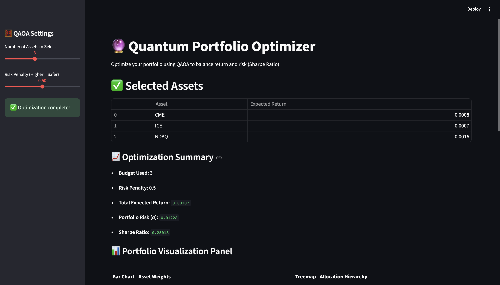
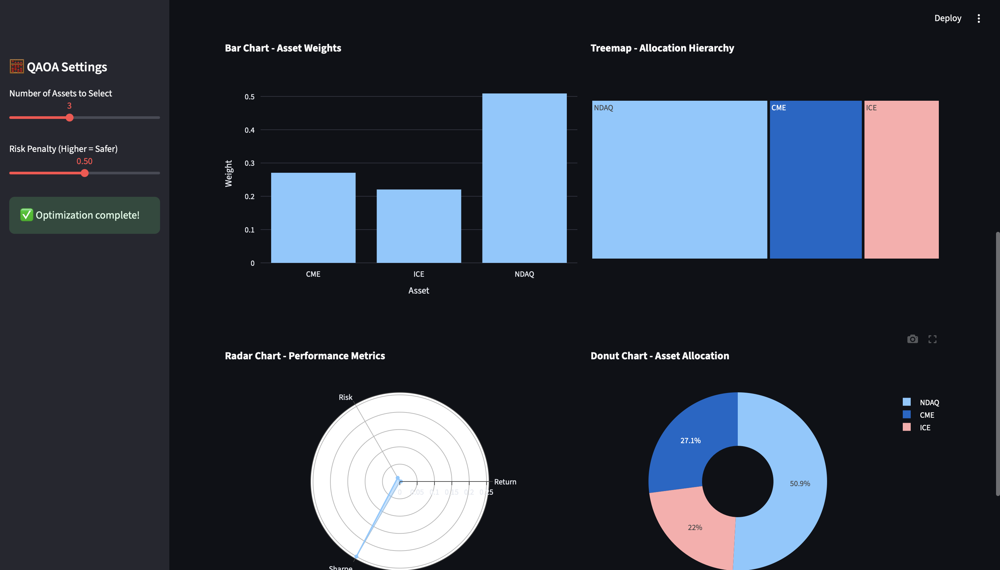

# 🔮 Quantum Portfolio Optimizer

> A hybrid quantum-classical dashboard to **optimize financial portfolios** using **QAOA (Quantum Approximate Optimization Algorithm)**. Built with **Qiskit** and **Streamlit**, this project helps investors make smarter, risk-aware decisions using cutting-edge quantum computing techniques.
>
### 🖼️ Dashboard Overview

Quantum Portfolio Optimizer – Qiskit, QAOA, Streamlit, Python
Developed a quantum-enhanced portfolio optimization dashboard using QAOA (Quantum Approximate Optimization Algorithm) to maximize expected returns and minimize portfolio risk via Sharpe ratio. Formulated the optimization as a QUBO problem and implemented it using Qiskit’s MinimumEigenOptimizer with the Aer simulator backend. Built a responsive Streamlit interface with dynamic controls for budget and risk penalty, and integrated real-time visualizations of asset selection, allocation breakdown, and risk-return metrics. Designed for quantum-aware decision support in finance with hybrid classical-quantum architecture.

## 🧠 Problem Statement

In modern finance, portfolio optimization is about selecting the best subset of assets to **maximize returns** while **minimizing risk**. Traditional methods use convex optimization. In this project, we reformulate it as a **QUBO problem** and solve it using **Quantum Computing** — specifically **QAOA** via IBM's Qiskit framework.

---

## 🏗️ Project Architecture
📁 quantum_portfolio_optimizer/
│
├── 📂 data/
│   ├── mean_returns.csv         # Expected return of each asset
│   └── cov_matrix.csv           # Covariance matrix between assets (risk)
│
├── 📂 src/
│   └── dashboard.py             # Main Streamlit dashboard UI + QAOA logic
│
├── .venv/                       # Virtual environment (not committed)
├── requirements.txt            # Project dependencies
└── README.md                   # You’re reading it

---
📈 Optimization Logic

We solve the following problem:

[
\text{Minimize: } - \sum R_i x_i + \lambda \cdot x^T \cdot C \cdot x
]

Where:
	•	( x_i \in {0, 1} ) – whether asset ( i ) is selected
	•	( R_i ) – expected return of asset ( i )
	•	( C ) – covariance matrix (risk)
	•	( \lambda ) – risk penalty

---

## 🚀 Features

- ✅ **Streamlit Web Interface**
- 🧮 QAOA Optimization using `qiskit.optimization`
- 📉 Sharpe Ratio, Portfolio Risk, and Return Calculation
- 📊 Real-time Visualizations
- 🧠 Adjustable **Risk Penalty** and **Budget Constraints**
- 🖥️ Uses **Aer Simulator** – no real quantum device needed

---

## 📸 Screenshots

| Streamlit Dashboard | QAOA Result | Allocation Visualization |
|---------------------|-------------|---------------------------|
|  |  |  |

---

## ⚙️ Installation & Running

### 1️⃣ Clone this repo

git clone https://github.com/<your-username>/quantum_portfolio_optimizer.git
cd quantum_portfolio_optimizer 

2️⃣ Create Virtual Environment (Optional)
python3 -m venv .venv
source .venv/bin/activate  # macOS/Linux
# OR
.venv\Scripts\activate     # Windows

3️⃣ Install Dependencies
pip install -r requirements.txt

4️⃣ Run the App
streamlit run src/dashboard.py

5️⃣ App will open at:
http://localhost:8501

You can easily:
	•	Add more assets to the mean_returns.csv
	•	Replace the covariance matrix with real-time data
	•	Integrate with Yahoo Finance or Alpha Vantage API for live updates
	•	Use QiskitRuntimeService to run on real quantum hardware

Acknowledgements
	•	IBM Qiskit
	•	Streamlit
	•	QAOA
	•	Special thanks to IBM, TCS, and AP Gov Quantum Valley Hackathon for inspiring this project.
